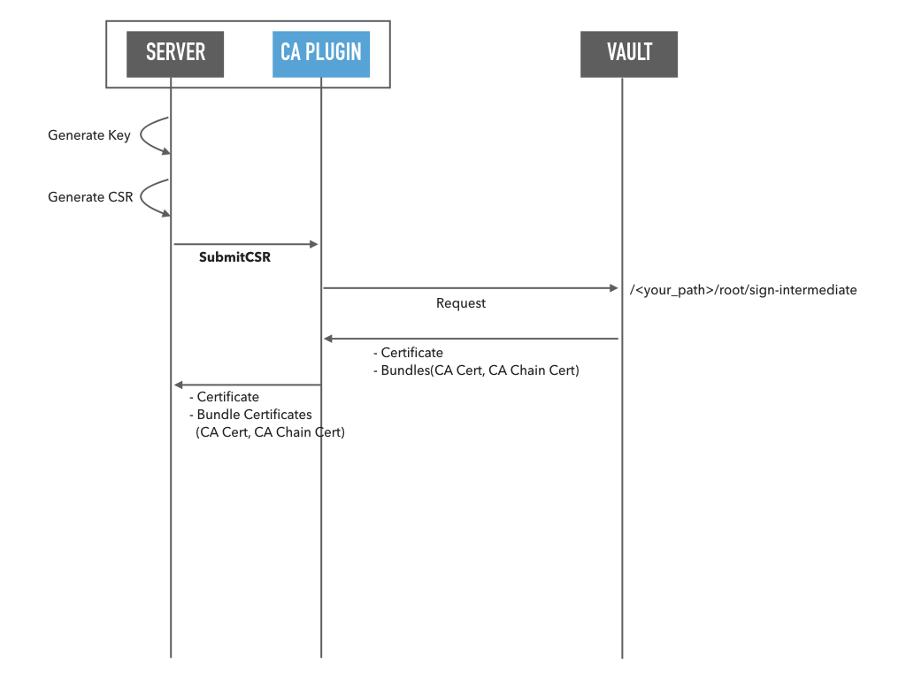

# spire-vault-plugin
This repository contains the Vault based SPIRE plugins.

## Upstream CA "vault" Plugin
This plugin regards HashiCorp Vault as the Upstream CA and requests to sign and create an intermediate certificate.

### Documents

[Plugin Documents](doc/vault-upstream-ca.md)

### Diagram

## LICENSE

This software is released under the MIT License.
