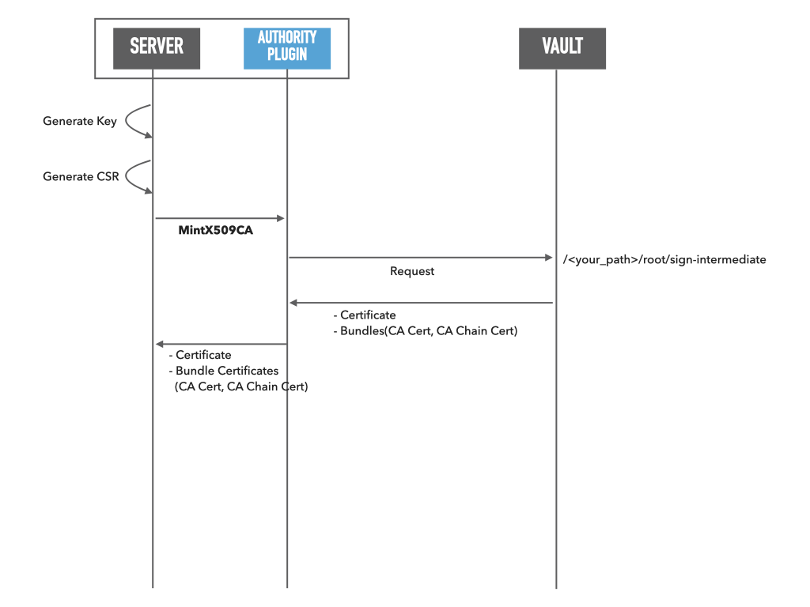

# spire-vault-plugin
This repository contains the Vault based SPIRE plugins.

## UpstreamAuthority "vault" Plugin
This plugin regards HashiCorp Vault as the Upstream PKI and requests to sign and create an intermediate certificate.

### Documents
- [UpstreamAuthority Plugin Documents](doc/vault-upstream-authority.md)

### Diagram

## (Deprecated) Upstream CA "vault" Plugin
This plugin regards HashiCorp Vault as the Upstream CA and requests to sign and create an intermediate certificate.

### Documents

- [(Deprecated) UpstreamCA Plugin Documents](doc/vault-upstream-ca.md)

## LICENSE

This software is released under the MIT License.
